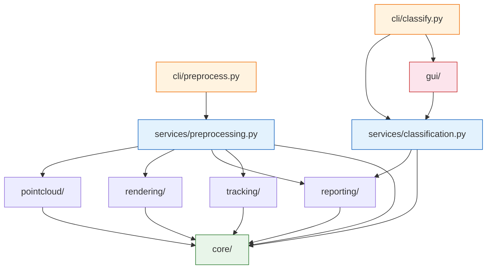

# Tree Classification Tool — Architecture Plan

**Goal:** Design a production-ready, modular Python architecture for a two-pipeline CLI application (LiDAR preprocessing + manual classification GUI).

**Architecture:** Layered design with crate-like Python packages under `src/`. Each functional domain is a self-contained package with explicit public API. Dependencies flow strictly downward: CLI/GUI → Services → Domain packages → Core. **GUI is a thin presentation module — all business logic lives in backend services usable without any GUI.**

**Tech Stack:** Python 3.12, `uv` for packaging, `laspy` (point cloud I/O), `torch` (GPU rendering), `fpdf2` (PDF generation), `PyMuPDF` (PDF display), `pyproj` (CRS transforms), `PySide6` (GUI), `argparse` (CLI), `pytest` (testing).

**Cross-platform:** Windows, Linux, macOS. All dependencies are cross-platform. `PySide6` supports Qt6, Wayland, and NVIDIA configurations. `torch` provides CPU wheels for all platforms; CUDA is optional (Linux/Windows only).

---

## User Review Required

> [!IMPORTANT]
> The following design decisions need your sign-off before implementation begins.

### 1. GUI Framework

| Option | Licencja | Windows/Linux/macOS | Wayland+NVIDIA |
|--------|----------|---------------------|----------------|
| **PySide6** (recommended) | LGPL (kompatybilne z MIT) | ✅ | ✅ |
| PyQt6 | GPL (niekompatybilne z MIT) | ✅ | ✅ |

**Recommendation:** PySide6. Zapewnia nowoczesne, bogate UI (Qt6), wspiera Wayland i jest kompatybilne z licencją MIT. GUI jest oddzielone warstwą serwisów.

### 2. PDF Generation Library

| Option | Licencja | Pros | Cons |
|--------|----------|------|------|
| **fpdf2** (recommended) | LGPL | Lekki, pure Python, dobry layout obrazów | Mniej funkcji dla złożonych layoutów |
| reportlab | BSD (open) / komercyjna (extra) | Standard branżowy | Cięższy |

### 3. Coordinate System / Lat-Long

> [!IMPORTANT]
> Workplan wymaga "lat + long position of a tree". Jak twoje pliki `.laz` przechowują współrzędne?

- **Option A:** Pliki używają rzutowanego CRS (np. UTM, EPSG:2180). Odczytamy CRS z nagłówka LAS i transformujemy do WGS84 lat/long przez `pyproj`.
- **Option B:** Współrzędne już w lat/long (WGS84). Używamy centroidu drzewa bezpośrednio.
- **Option C:** Pliki bez informacji o CRS. Zapisujemy surowe XY centroidu.

**Recommendation:** Option A z fallbackiem do C. `pyproj` jest lekki i obsługuje to czysto.

---

## Open Questions

> [!NOTE]
> **RGB depth maps:** Workplan wspomina "if given, the rgb values are used to colour the depth maps instead." Protokół `Renderer` obsłuży oba przypadki — ale to istotna zmiana w renderowaniu. Zakładamy to jako feature opcjonalny? (Tak, jeśli dane RGB są dostępne w LAZ).

---

## Key Design Principle: GUI as a Thin Module

```
┌─────────────────────────────────────────────────┐
│  Presentation Layer (replaceable)               │
│  ┌──────────┐  ┌──────────┐  ┌───────────────┐ │
│  │ CLI      │  │ PySide6  │  │ Future: web   │ │
│  │          │  │ GUI      │  │ API / Qt / etc│ │
│  └────┬─────┘  └────┬─────┘  └───────┬───────┘ │
│       │              │                │         │
├───────┴──────────────┴────────────────┴─────────┤
│  Services Layer (backend API)                   │
│  ┌────────────────────┐ ┌─────────────────────┐ │
│  │ PreprocessingService│ │ClassificationService│ │
│  └────────┬───────────┘ └──────────┬──────────┘ │
│           │                        │            │
├───────────┴────────────────────────┴────────────┤
│  Domain Layer (crate-like packages)             │
│  pointcloud/  rendering/  reporting/  tracking/ │
│                                                 │
├─────────────────────────────────────────────────┤
│  Core Layer (models + protocols)                │
│  core/                                          │
└─────────────────────────────────────────────────┘
```

**The GUI calls only service methods. Services expose all operations as a programmatic API.** This means:
- `PreprocessingService` can be used from CLI, scripts, tests, or any future frontend.
- `ClassificationService` manages navigation state, label read/write, page access — GUI just displays and forwards user actions.
- Adding a REST API or web frontend = new presentation module consuming existing services.

---

## Project Structure

```
tree-classification-tool/
├── src/
│   └── tree_classification/          # Root package
│       ├── __init__.py
│       ├── core/                     # Layer 0: Models + Protocols
│       │   ├── __init__.py
│       │   ├── models.py             # Dataclasses: PointCloud, TreeData, TreeReport, TreeLabel
│       │   └── protocols.py          # Abstract interfaces (Protocol classes)
│       ├── pointcloud/               # Layer 1: Point cloud I/O
│       │   ├── __init__.py
│       │   ├── reader.py             # Read .laz/.las → PointCloud
│       │   ├── writer.py             # Write TreeData → .laz/.las
│       │   └── extraction.py         # Extract individual trees from PointCloud
│       ├── rendering/                # Layer 1: Depth map generation
│       │   ├── __init__.py
│       │   └── depth_map.py          # cloud2sideView (CPU/CUDA), RGB variant
│       ├── reporting/                # Layer 1: PDF + CSV generation/reading
│       │   ├── __init__.py
│       │   ├── pdf_writer.py         # Compose tree images into PDF pages
│       │   ├── pdf_reader.py         # Read PDF pages for display
│       │   └── csv_store.py          # Read/write tree label CSV
│       ├── tracking/                 # Layer 1: Processing state
│       │   ├── __init__.py
│       │   └── file_tracker.py       # processed.txt + error_files.txt
│       ├── services/                 # Layer 2: Backend API (headless)
│       │   ├── __init__.py
│       │   ├── preprocessing.py      # PreprocessingService — full pipeline orchestration
│       │   └── classification.py     # ClassificationService — navigation, labels, page access
│       ├── gui/                      # Layer 3: PySide6 GUI (thin presentation)
│       │   ├── __init__.py
│       │   ├── app.py                # Main QMainWindow — consumes ClassificationService
│       │   └── widgets.py            # LabelCombobox, PdfPageViewer
│       └── cli/                      # Layer 3: CLI entry points
│           ├── __init__.py
│           ├── preprocess.py         # argparse CLI for pipeline 1
│           └── classify.py           # argparse CLI for pipeline 2
├── tests/                            # Integration tests
│   ├── conftest.py
│   ├── test_preprocessing_service.py
│   └── test_classification_service.py
├── docs/
│   ├── workplan.md
│   ├── AGENTS.md
│   ├── status.md
│   └── plans/
├── main.py                           # Thin entry point: delegates to cli
├── pyproject.toml
├── .python-version
└── README.md
```

---

## Dependency Graph



**Layer 0 (Core):** No external deps. Pure data models and protocols.
**Layer 1 (Domain):** Each package depends only on `core/` and its own external libs. No cross-deps between Layer 1 packages.
**Layer 2 (Services):** Orchestrate Layer 1 packages. Fully headless — no GUI imports. This IS the backend API.
**Layer 3 (Presentation):** CLI and GUI. Both consume services. GUI is removable without breaking anything.

> [!TIP]
> The strict layering means: remove `gui/` entirely and the program still works via CLI. Add a REST server and it consumes the same `services/` layer. Any Layer 1 package can be swapped independently via protocols.

---

## Proposed Changes

### Core Package — `src/tree_classification/core/`

The foundation everything else depends on. Zero external dependencies (except `numpy` for array types).

---

#### [NEW] `src/tree_classification/core/models.py`

```python
from dataclasses import dataclass
import numpy as np
from numpy.typing import NDArray


@dataclass(frozen=True)
class PointCloud:
    """Raw point cloud data as read from a .laz/.las file."""
    points: NDArray[np.float64]       # (N, 3) — XYZ
    tree_ids: NDArray[np.int64]       # (N,)
    rgb: NDArray[np.uint8] | None     # (N, 3) or None
    crs_wkt: str | None               # WKT string from LAS header, or None


@dataclass(frozen=True)
class TreeData:
    """Single extracted tree with computed metadata."""
    tree_id: int
    points: NDArray[np.float64]       # (N, 3) — XYZ
    rgb: NDArray[np.uint8] | None     # (N, 3) or None
    latitude: float
    longitude: float
    height: float
    source_filename: str              # original .laz/.las filename (no ext)


@dataclass
class TreeLabel:
    """One row in the CSV label store."""
    tree_id: int
    latitude: float
    longitude: float
    height: float
    source_tree_id: str               # "{source_filename}_{tree_id}"
    label: int                        # -2 = unclassified, or user-provided integer from labels.json


@dataclass(frozen=True)
class TreeReport:
    """A tree with its rendered views, ready for PDF composition."""
    tree: TreeData
    views: list[NDArray[np.float32]]  # 5 images, each (H, W) or (H, W, 3)
```

---

#### [NEW] `src/tree_classification/core/protocols.py`

```python
from typing import Protocol, runtime_checkable
from pathlib import Path
import numpy as np
from numpy.typing import NDArray

from tree_classification.core.models import PointCloud, TreeData, TreeLabel


@runtime_checkable
class PointCloudReader(Protocol):
    def read(self, path: Path) -> PointCloud: ...

@runtime_checkable
class PointCloudWriter(Protocol):
    def write(self, tree: TreeData, output_path: Path, source_format: str) -> None: ...

@runtime_checkable
class Renderer(Protocol):
    def render(self, points: NDArray[np.float64],
               rgb: NDArray[np.uint8] | None = None,
               resolution: int = 256) -> list[NDArray[np.float32]]: ...

@runtime_checkable
class ReportWriter(Protocol):
    def write_report(self, reports: list[TreeReport], output_path: Path) -> None: ...

@runtime_checkable
class LabelStore(Protocol):
    def read_labels(self, path: Path) -> list[TreeLabel]: ...
    def write_labels(self, labels: list[TreeLabel], path: Path) -> None: ...
    def update_label(self, path: Path, index: int, label: int) -> None: ...
```

> [!NOTE]
> Protocols zamiast ABC — duck typing z wsparciem type checkera. Każdy obiekt z pasującymi metodami spełnia kontrakt.

---

### Pointcloud Package — `src/tree_classification/pointcloud/`

External deps: `laspy`, `pyproj`.

---

#### [NEW] `reader.py`
Implements `PointCloudReader`. Reads LAS/LAZ via `laspy`, extracts XYZ, `tree_ids`, optional RGB, CRS from VLR/header.

#### [NEW] `writer.py`
Implements `PointCloudWriter`. Writes single tree's points as new LAS/LAZ, preserving original format.

#### [NEW] `extraction.py`
Extracts `TreeData` from `PointCloud`: centroid → lat/long via `pyproj` (if CRS available, else raw XY), height = `max_z - min_z`.

---

### Rendering Package — `src/tree_classification/rendering/`

External dep: `torch`.

---

#### [NEW] `depth_map.py`
Implements `Renderer`. Contains `cloud2sideView` from workplan:
- 5 views: top, front, back, left, right.
- CPU/CUDA via `torch.device`.
- Grayscale or RGB (when rgb data provided).
- Resolution parameterised (default 256).

---

### Reporting Package — `src/tree_classification/reporting/`

External deps: `fpdf2`, `PyMuPDF`.

---

#### [NEW] `pdf_writer.py`
Implements `ReportWriter`. One PDF page per tree: row 1 = 3 images, row 2 = 2 images + metadata text.

#### [NEW] `pdf_reader.py`
Reads PDF pages via `PyMuPDF` (`fitz`). Returns page images as numpy arrays.

#### [NEW] `csv_store.py`
Implements `LabelStore`. CSV with columns: `tree_id, latitude, longitude, height, source_tree_id, label` (identical to `TreeLabel` field names).

---

### Tracking Package — `src/tree_classification/tracking/`

No external deps beyond stdlib.

---

#### [NEW] `file_tracker.py`
Manages `processed.txt` and `error_files.txt`:
- `is_processed(path) -> bool`
- `mark_processed(path) -> None`
- `log_error(path) -> None`
- `get_errors() -> list[Path]`

---

### Services Package — `src/tree_classification/services/` ⭐ Backend API

**This is the key layer.** Fully headless. No GUI imports. Usable from CLI, scripts, tests, future REST API.

---

#### [NEW] `src/tree_classification/services/preprocessing.py`

```python
class PreprocessingService:
    """Backend API for the preprocessing pipeline. No GUI dependency."""

    def __init__(self, reader: PointCloudReader,
                 writer: PointCloudWriter,
                 renderer: Renderer,
                 report_writer: ReportWriter,
                 label_store: LabelStore,
                 tracker: FileTracker,
                 output_dir: Path):
        ...

    def process_file(self, input_path: Path) -> None:
        """Process a single .laz/.las file through the full pipeline."""
        # 1. Check tracker → skip if processed
        # 2. Read point cloud
        # 3. Extract trees
        # 4. Render views per tree
        # 5. Write PDF report
        # 6. Write CSV with labels (-2)
        # 7. Write individual tree PCDs
        # 8. Mark processed
        # On error: log to error_files.txt, continue

    def process_directory(self, input_dir: Path) -> None:
        """Process all .laz/.las files in a directory."""
        ...
```

#### [NEW] `src/tree_classification/services/classification.py`

```python
class ClassificationService:
    """Backend API for tree classification. No GUI dependency.

    Manages navigation state, label persistence, and page access.
    GUI or any other frontend calls these methods.
    """

    def __init__(self, pdf_reader: PdfReader,
                 label_store: LabelStore,
                 pdf_path: Path,
                 csv_path: Path,
                 labels_mapping: dict[int, dict[str, str]]):
        ...

    @property
    def current_index(self) -> int: ...

    @property
    def total_pages(self) -> int: ...

    @property
    def current_label(self) -> TreeLabel: ...

    @property
    def available_labels(self) -> dict[int, dict[str, str]]: ...

    def get_page_image(self, index: int) -> NDArray[np.uint8]:
        """Return rendered PDF page as image array."""
        ...

    def set_label(self, index: int, value: int) -> None:
        """Set label for tree at index (in memory)."""
        ...

    def save_label(self, index: int) -> None:
        """Persist current label to CSV."""
        ...

    def next_page(self) -> bool:
        """Save current label and advance. Returns False if at end."""
        ...

    def previous_page(self) -> bool:
        """Discard changes and go back. Returns False if at start."""
        ...

    def save_and_quit(self) -> None:
        """Save current label and signal exit."""
        ...

    def find_first_unclassified(self) -> int:
        """Return index of first tree with label '-2'."""
        ...
```

> [!TIP]
> `ClassificationService` is fully testable without tkinter. Unit tests call `next_page()`, `set_label()`, etc. and verify CSV state. GUI tests become trivial — just verify widgets call the right service methods.

---

### GUI Package — `src/tree_classification/gui/`

**Thin presentation layer.** Only imports `services/` and `PySide6`. Zero business logic.

---

#### [NEW] `src/tree_classification/gui/app.py`

```python
import sys
from PySide6.QtWidgets import QApplication, QMainWindow, QVBoxLayout, QHBoxLayout, QWidget, QPushButton

class ClassificationGUI(QMainWindow):
    """Thin PySide6 frontend. All logic delegated to ClassificationService."""

    def __init__(self, service: ClassificationService):
        super().__init__()
        self.service = service
        self._build_ui()
        self._load_page(service.find_first_unclassified())

    def _build_ui(self) -> None:
        # Upper: PDF page image (QLabel/QGraphicsView)
        # Lower: [Previous] [Next] [Save & Quit] + LabelCombobox
        ...

    def _on_next(self) -> None:
        self.service.next_page()       # service handles save + advance
        self._load_page(self.service.current_index)

    def _on_previous(self) -> None:
        self.service.previous_page()   # service handles discard + go back
        self._load_page(self.service.current_index)

    def _on_save_quit(self) -> None:
        self.service.save_and_quit()   # service handles save
        self.close()

def run_app(service: ClassificationService) -> None:
    app = QApplication(sys.argv)
    gui = ClassificationGUI(service)
    gui.show()
    sys.exit(app.exec())
```

#### [NEW] `src/tree_classification/gui/widgets.py`
- `LabelCombobox` — `QComboBox` with pre-populated common labels, free-text input (int, Latin, Polish).
- `PdfPageViewer` — displays a numpy image array in a `QLabel` (by converting via QImage).

---

### CLI Package — `src/tree_classification/cli/`

Thin entry points. Construct concrete implementations, pass to services.

---

#### [NEW] `cli/preprocess.py`

```python
def main() -> None:
    parser = argparse.ArgumentParser(description="Preprocess LiDAR tree data")
    parser.add_argument("input_path", type=Path)
    parser.add_argument("output_dir", type=Path)
    parser.add_argument("--device", choices=["cpu", "cuda"], default="cpu")
    args = parser.parse_args()

    service = PreprocessingService(
        reader=LaspyReader(),
        writer=LaspyWriter(),
        renderer=DepthMapRenderer(device=args.device),
        report_writer=PdfReportWriter(),
        label_store=CsvLabelStore(),
        tracker=FileTracker(args.output_dir),
        output_dir=args.output_dir,
    )

    if args.input_path.is_dir():
        service.process_directory(args.input_path)
    else:
        service.process_file(args.input_path)
```

#### [NEW] `cli/classify.py`

```python
def main() -> None:
    parser = argparse.ArgumentParser(description="Classify trees from PDF reports")
    parser.add_argument("directory_path", type=Path)
    parser.add_argument("--labels", type=Path, default=Path("labels.json"), help="Path to species JSON mapping")
    args = parser.parse_args()

    import json
    # Convert string keys from JSON back to int using pathlib
    labels_mapping = {int(k): v for k, v in json.loads(args.labels.read_text(encoding="utf-8")).items()}

    for pdf_path, csv_path in discover_report_pairs(args.directory_path):
        service = ClassificationService(
            pdf_reader=FitzPdfReader(),
            label_store=CsvLabelStore(),
            pdf_path=pdf_path,
            csv_path=csv_path,
            labels_mapping=labels_mapping,
        )
        from tree_classification.gui.app import run_app
        run_app(service)
```

---

#### [MODIFY] `main.py`

```python
import sys

def main():
    if len(sys.argv) < 2:
        print("Usage: python main.py {preprocess|classify} [args...]")
        sys.exit(1)

    command = sys.argv[1]
    sys.argv = [sys.argv[0]] + sys.argv[2:]

    if command == "preprocess":
        from tree_classification.cli.preprocess import main as run
        run()
    elif command == "classify":
        from tree_classification.cli.classify import main as run
        run()
    else:
        print(f"Unknown command: {command}")
        sys.exit(1)

if __name__ == "__main__":
    main()
```

---

#### [MODIFY] `pyproject.toml`

```toml
[project]
name = "tree-classification-tool"
version = "0.1.0"
description = "CLI tool for LiDAR tree point cloud preprocessing and manual classification"
readme = "README.md"
requires-python = ">=3.12"
dependencies = [
    "laspy[lazrs]",
    "torch",
    "fpdf2",
    "PyMuPDF",
    "pyproj",
    "numpy",
    "Pillow",
]

[project.optional-dependencies]
test = [
    "pytest",
]

[project.scripts]
tree-preprocess = "tree_classification.cli.preprocess:main"
tree-classify = "tree_classification.cli.classify:main"

[tool.setuptools.packages.find]
where = ["src"]
```

---

## Extensibility Points

| Change | What to do |
|--------|------------|
| Add `.ply` input support | New `PlyReader` implementing `PointCloudReader` |
| REST / web API frontend | New module importing `services/`, no GUI needed |
| Switch to HTML reports | New class implementing `ReportWriter` |
| Auto-classification ML model | New service consuming `TreeReport`, producing labels |
| Store labels in SQLite | New class implementing `LabelStore` |
| Different rendering approach | New class implementing `Renderer` |
| Replace tkinter with Qt | New `gui/` module consuming same `ClassificationService` |

---

## Verification Plan

### Automated Tests

```bash
# Unit tests (inline, per AGENTS.md)
uv run pytest src/ -v

# Integration tests
uv run pytest tests/ -v

# All tests
uv run pytest -v
```

**Key: services are testable without GUI.** `ClassificationService` tests verify navigation and CSV state by calling methods directly. No tkinter needed.

### Manual Verification

1. **Preprocessing:** Run on sample `.laz`, verify output dir structure, PDF layout, CSV columns, `-2` labels.
2. **Classification GUI:** Open generated PDF+CSV, verify navigation, label input (int + text + Polish + dropdown), save, resume from first `-2`.
3. **Resilience:** Process same file twice (should skip), corrupt file (should land in `error_files.txt`).
4. **Cross-platform:** Verify on macOS + one other OS (Windows or Linux).

---

## Implementation Order

1. **Core models + protocols** — foundation, no external deps
2. **Tracking** — `file_tracker.py`, simple file I/O
3. **Pointcloud reader/writer/extraction** — requires `laspy`, `pyproj`
4. **Rendering** — requires `torch`
5. **Reporting (PDF writer + CSV store)** — requires `fpdf2`
6. **PreprocessingService** — wires 2-5 together
7. **CLI preprocess** — thin wrapper
8. **Reporting (PDF reader)** — requires `PyMuPDF`
9. **ClassificationService** — navigation, labels, page access
10. **GUI widgets + app** — tkinter frontend
11. **CLI classify** — thin wrapper
12. **Integration tests** — end-to-end

**Plan complete. Two execution options:**

1. **Subagent-Driven (this session)** — fresh subagent per task, review between tasks, fast iteration.
2. **Parallel Session (separate)** — open new session with executing-plans, batch execution with checkpoints.

**Which approach?**
